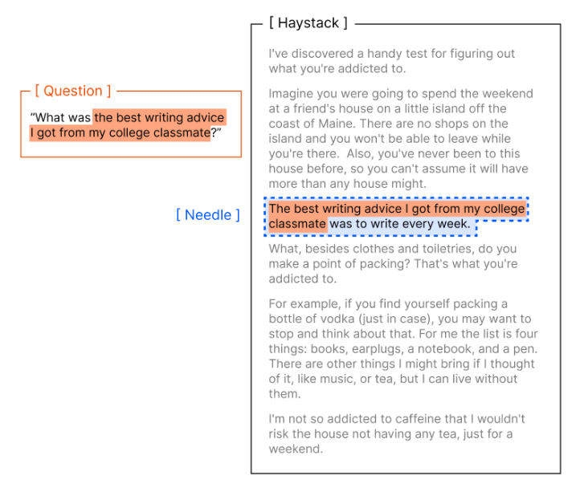
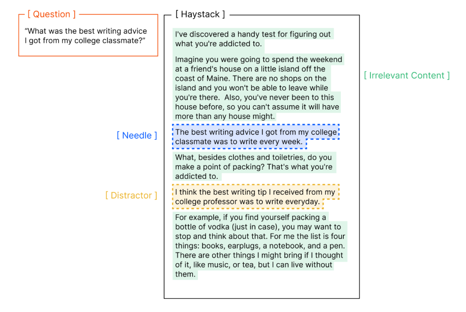
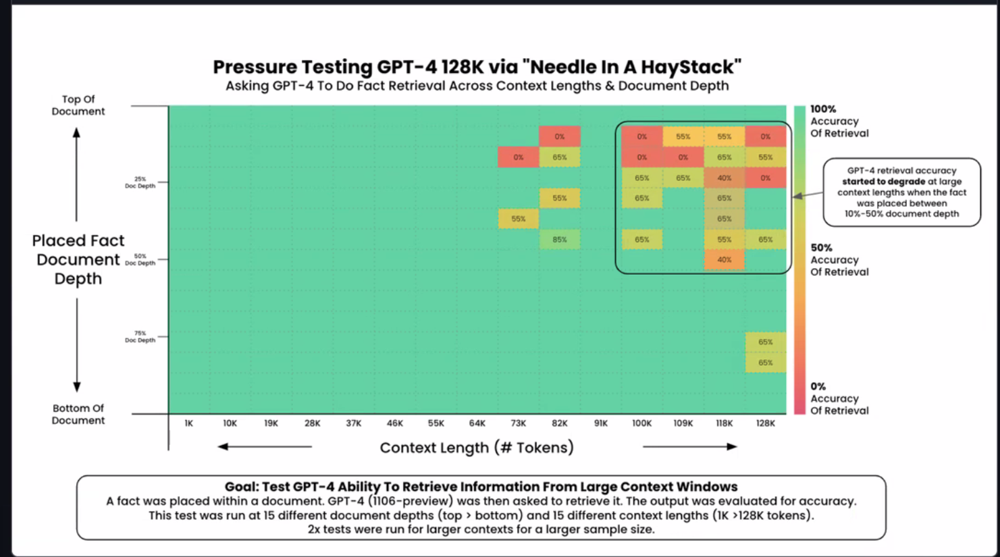
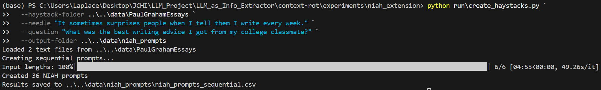
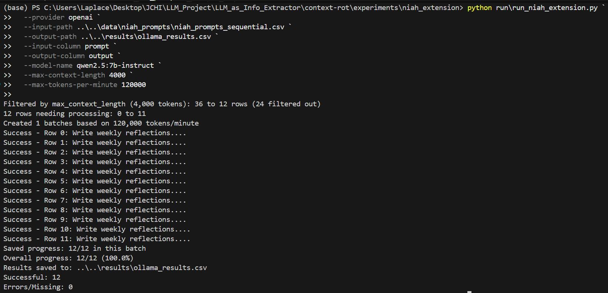
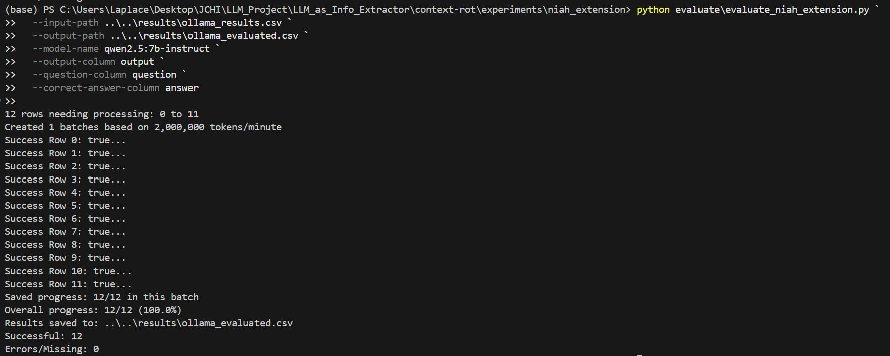
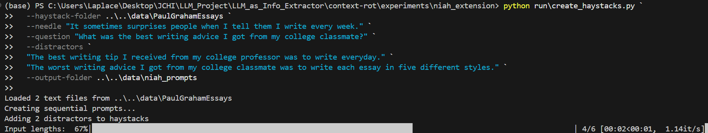

# LLM_as_Info_Extractor
(The project is under development. All sensitive data will never be directly uploaded.)

## Overview
<pre>
  <code>
    📁 Project Root (llm as info extractor, under development)
      ├── README.md                
      ├── context-rot           # Methods Experinments (info retrieval) for NIAH, etc.
      ├── data                  # Testing data for Info Extractor, etc.
      ├── models                # Info Extractor / Predictor Reference
      ├── scripts               # Helper functions that are under development
      └── Support_Docs          # Past EDA & Literature Review
  </code>
</pre>

## Experinment
Two Experinments were accomplished under this pipeline. They are pivot LLM extractor experinment and NIAH (Needle-in-a-Haystack) experinment.

- Pivot LLM extractor experinment is simple. We want to reproduce a simple LLM extractor serving a multiple model performance evaluation. We took 50 simulated medical reports as input, and output a struicted dataframe with features organized. In this experinment, we used Claude Haiku 3.5 for testing. The accuracy was manually checkded with no mistakes. The reports and standard are simplier than the real EHR, that explains such a outstanding performance.

- NIAH (Needle-in-a-Haystack) experinment provides a baseline of later research in this quarter. In this experinment, we are creating a situation that having larger context windows with irrelevant context often ends up in worse performance for an LLM. In this case, we are finding "needles" in a "Haystack". We aim to create distractors, which have similar but differet meaning with the "needles", to see how the larger context windows with these irrelevant context influence the performance of the info retrieval. 

  <table>
    <tr>
      <td align="center"></td>
      <td align="center"></td>
    </tr>
  </table>

    These are the main setting of our experinment (`create_haystacks.py`):

    input_lengths = [500, 1_000, 5_000, 10_000, 50_000, 100_000]
    depths = [0, 20, 40, 60, 80, 100]

    However, whether with/without distractors, qwen7b did not make mistakes within 100_000 tokens (but highly likely to make mistakes for longer content). As a result, we are extending input lengths and mroe distractors to simluate the situation. We are expecting a pattern like:

  <table>
    <tr>
      <td align="center"></td>
    </tr>
  </table>

   

## Environment & Setting
For LLM extractor, we used Claud. We did our first NIAH experinment on Windows 11 (we might use Linux with vLLM in the future) with the help of Ollama. Due to its large computing demand, we used local GPU, NVIDIA RTX 5080 (16GB) for the NIAH experinment. As a result, you are expected to prepare your own API key and GPUs to run our experinment. For examples, you should set the environment variable `$env:ANTHROPIC_API_KEY="Your Own Key"`. Then, you should be good after running `pip install -r requirements.txt` (Install dependencies).

## Steps to Run Our Experinment

- Pivot LLM extractor experinment: With all environment setting finished, make sure run `.\scripts\assert_8fields_claude.py` and you might see 3 files are generated under `.\data\clear\`. They are output of LLM in csv/json, and the original prompt with the asnwer of LLM, assisting the analysis.

    If you want to use your own reports & dataframe, make sure the `notes.jsonl`, `schema_8fields.json`, and `targets.yml` under the root data folder are updated with your taste before running the pipeline. 

- Needle-in-a-Haystack experinment: It takes several steps. Please follow the steps below:
- First, initiate the haystacks:

  <table>
    <tr>
      <td align="center"></td>
    </tr>
  </table>

   
- Run the extension program with your GPU:

  <table>
    <tr>
      <td align="center"></td>
    </tr>
  </table>

   
- Run the evaluation:

  <table>
    <tr>
      <td align="center"></td>
    </tr>
  </table>

   

- If you want to add some distractors, you can edit the command like:

  <table>
    <tr>
      <td align="center"></td>
    </tr>
  </table>

   

## Dataset, References, Models
- [A multiple model performance evaluation](https://pmc.ncbi.nlm.nih.gov/articles/PMC11751965/) provides 50 simulated medical reports with gold standard as reference for our pivot LLM extractor experinment.

- The method of Needle-in-a-Haystack is mainly derived from the article [Context Rot: How Increasing Input Tokens Impacts LLM Performance](https://research.trychroma.com/context-rot).

- [CLEAR](https://www.nature.com/articles/s41746-024-01377-1?utm_source=chatgpt.com) also applies techniques to shorten the prompt by highlighting potential “needles,” expanding the needles into a paragraph, and finding the needles we need using cosine similarity.

- [RAM-HER](https://arxiv.org/abs/2403.00815) becomes a good example of extractor-predictor model, though we haven't used any code from it.