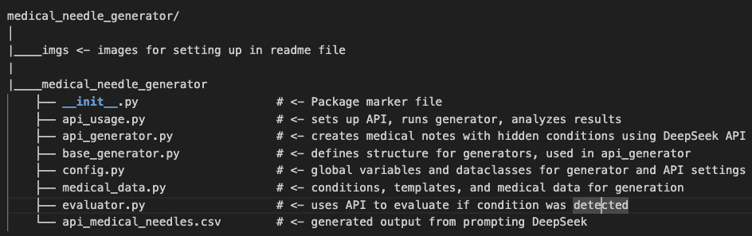
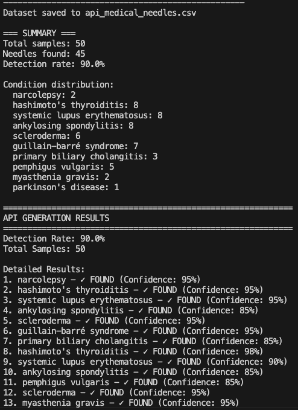

# LLM_as_Info_Extractor

## Medical Needle Dataset Generator
A Python tool for generating medical notes with hidden conditions and retrieving those conditions to test Large Language Model capabilitieso on medical information extraction and reasoning.

## Overview
This tool creates realistic medical notes that contain subtle clues about specific medical conditions without explicitly stating them. It then evaluates whether LLMs can correctly identify these hidden conditions. Our goal is to test LLMs on real data and to see whether LLM's can be used for information extraction in the medical field.

## Features
1. Generate medical notes by prompting DeepSeek to generate a medical note for a given condition
2. Input the medical note into DeepSeek and prompt it to detect what condition the patient has and output its confidence level in its answer (0-100%)
3. Evaluate whether the retrieval was success and outputting the accuracy.

## Project Structure

## Environment & Setting
This experiment was done on a local machine. While this code could also be run on a GPU, the computation is mostly remote and not local. This code contains built-in rate limiting, such as "time.sleep(2)" to avoid hitting rate limits. The primary bottleneck of this experiment is the rate limit from DeepSeek and other LLMs in general, which results in error messages when we do not manually rate-limit our API calls. However, is not always the case, and local GPUs are useful for running other models, such as Llama 2.

## Usage Instruction
To use this repository, a DeepSeek API key is required, which can be found on their website. After getting the key, 

1. Obtain a DeepSeek API key from DeepSeek Platform
2. clone this branch of the repository
3. run in terminal "export DEEPSEEK_API_KEY={your API key}". 
4. Install the dependencies using "pip install -r requirements.txt". 
5. run 'python api_usage.py' to use the API to generate and evaluate needles. The results of the prompt are located in api_medical_needles.csv.

When you run python api_usage.py, these messages should appear

This is what it should look like when it's running.

When it's finished running, it should output the results of the generating and retrieval process.